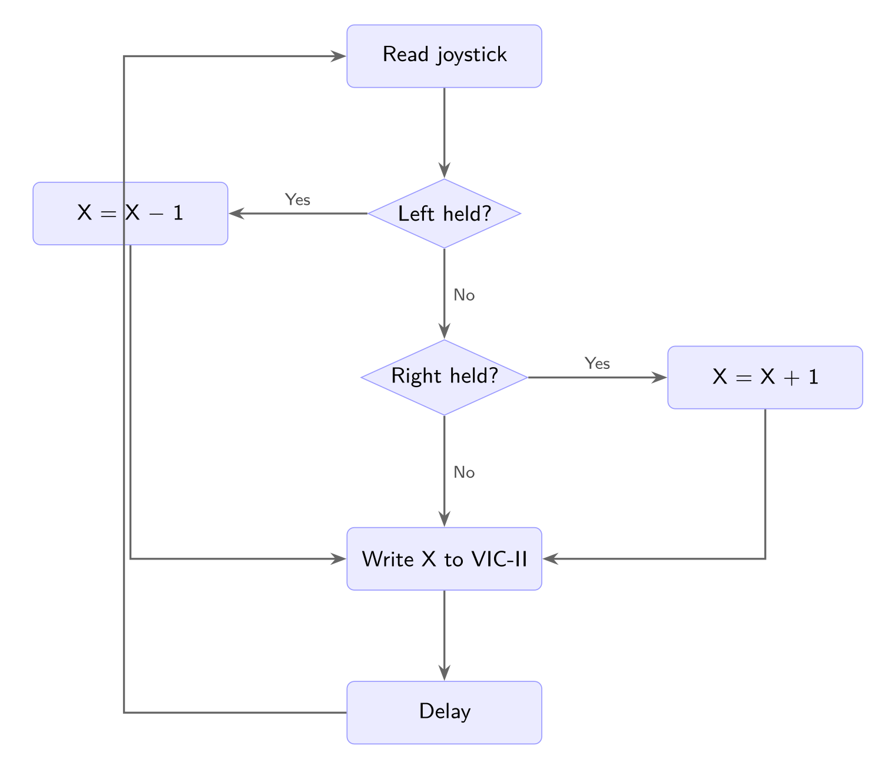

# Chapter 7: Moving Sprites

The bucket from Chapter 6 comes to life — joystick left and right moves it across the screen, and it can cross the X=255 boundary without glitching. This is our first game loop.

## The Code

Create `src/bucket.asm`:

```asm
; bucket.asm - Move a sprite with the joystick
; Left/right controls the bucket at the bottom of the screen

* = $0801                       ; BASIC start address

; BASIC stub: 10 SYS 2304
!byte $0b, $08                  ; Pointer to next BASIC line
!byte $0a, $00                  ; Line number 10
!byte $9e                       ; SYS token
!text "2304"                    ; Address as ASCII
!byte $00                       ; End of line
!byte $00, $00                  ; End of BASIC program

; --- Sprite Data ---
* = $0840                       ; Bucket sprite (pointer = 33)

bucket_data:
    !fill 36, 0                 ; Rows 0-11: empty
    ; Row 12-13: rim (full width)
    !byte %11111111,%11111111,%11111111
    !byte %11111111,%11111111,%11111111
    ; Row 14-15: body tapers
    !byte %01111111,%11111111,%11111110
    !byte %01111111,%11111111,%11111110
    ; Row 16-17
    !byte %00111111,%11111111,%11111100
    !byte %00111111,%11111111,%11111100
    ; Row 18-19
    !byte %00011111,%11111111,%11111000
    !byte %00011111,%11111111,%11111000
    ; Row 20: bottom
    !byte %00001111,%11111111,%11110000

; --- Code ---
* = $0900                       ; Code start (2304 decimal)

sprite_x   = $02                ; Sprite X position, low byte
sprite_x_h = $03                ; Sprite X position, high byte (0 or 1)

    ; --- Initialize sprite ---

    ; Store starting position in zero page
    lda #172                    ; X = 172 (center)
    sta sprite_x
    lda #0                      ; High byte = 0 (X < 256)
    sta sprite_x_h

    ; Set sprite 0 data pointer
    lda #33                     ; Sprite data at $0840 (33 x 64)
    sta $07f8                   ; Sprite 0 pointer

    ; Enable sprite 0
    lda $d015                   ; Read sprite enable register
    ora #%00000001              ; Set bit 0 (sprite 0)
    sta $d015                   ; Write back

    ; Set Y position (fixed at bottom)
    lda #224                    ; Y position (near bottom)
    sta $d001                   ; Sprite 0 Y

    ; Set sprite color
    lda #$01                    ; White
    sta $d027                   ; Sprite 0 color

    ; --- Game loop ---

loop:
    lda $dc00                   ; Read joystick port 2
    and #%00000100              ; Test bit 2 (left)
    beq move_left

    lda $dc00                   ; Re-read
    and #%00001000              ; Test bit 3 (right)
    beq move_right

    jmp update                  ; No movement input

move_left:
    lda sprite_x                ; Load X low byte
    sec                         ; Set carry (prepare to subtract)
    sbc #1                      ; Subtract 1
    sta sprite_x                ; Store result
    lda sprite_x_h              ; Load X high byte
    sbc #0                      ; Subtract borrow
    sta sprite_x_h              ; Store result
    jmp update

move_right:
    lda sprite_x                ; Load X low byte
    clc                         ; Clear carry (prepare to add)
    adc #1                      ; Add 1
    sta sprite_x                ; Store result
    lda sprite_x_h              ; Load X high byte
    adc #0                      ; Add carry
    sta sprite_x_h              ; Store result

update:
    ; Write X position to VIC-II
    lda sprite_x                ; Low 8 bits of X
    sta $d000                   ; Sprite 0 X position

    ; Update X position MSB (bit 8)
    lda sprite_x_h              ; High byte (0 or 1)
    and #%00000001              ; Isolate bit 0
    beq msb_clear

    lda $d010                   ; Read MSB register
    ora #%00000001              ; Set bit 0 (sprite 0)
    sta $d010                   ; Write back
    jmp delay

msb_clear:
    lda $d010                   ; Read MSB register
    and #%11111110              ; Clear bit 0 (sprite 0)
    sta $d010                   ; Write back

delay:
    ldx #$08                    ; Outer loop: 8 iterations
delay_outer:
    ldy #$ff                    ; Inner loop: 255 iterations
delay_inner:
    dey                         ; Decrement Y
    bne delay_inner             ; Loop until Y = 0
    dex                         ; Decrement X
    bne delay_outer             ; Loop until X = 0

    jmp loop                    ; Back to game loop
```

The bucket from Chapter 6 is back, but now the joystick controls its horizontal position. The program reads input, updates a 16-bit position variable, writes the result to the VIC-II, waits briefly, and repeats. Let's work through each new concept.

## Code Explanation

### Memory Layout

Notice the new layout — sprite data sits *before* the code:

```
$0801-$080C: BASIC stub (SYS 2304)
$0840-$087F: Bucket sprite data (pointer 33)
$0900+     : Code
```

In Chapter 6, our code started at `$0810` and the sprite lived at `$0840` right after it. That worked because the code was tiny. Now that our programs will grow over the coming chapters, we're giving code its own region starting at `$0900`. The gap between `$0840` and `$0900` is exactly 192 bytes — room for three 64-byte sprites. The sprite data stays at fixed addresses and never needs to move, no matter how much code we add.

The BASIC stub changes accordingly: `SYS 2304` jumps to `$0900` instead of `$0810`.

### Game Variables and Zero Page

We need to track the sprite's X position between frames, which means storing it somewhere the game loop can read and write each iteration. We use **zero page** — the first 256 bytes of memory ($00-$FF):

```asm
sprite_x   = $02                ; Sprite X position, low byte
sprite_x_h = $03                ; Sprite X position, high byte (0 or 1)
```

Zero page is the C64's fastest memory — not because the RAM chips are faster, but because the CPU uses **2-byte instructions** instead of 3. A normal `lda $0400` assembles to 3 bytes (`AD 00 04`), but `lda $02` only needs 2 bytes (`A5 02`). That saves one byte of code *and* one clock cycle per access. For variables read every frame in a game loop, that speed difference adds up.

We pick `$02` and `$03` because they're safe to use. Addresses `$00` and `$01` are reserved by the CPU (the processor port), and while BASIC uses some zero page locations during execution, our program takes over completely after `SYS 2304` so we won't conflict. Locations `$02`-`$8F` are commonly used for game variables in C64 programs.

Note that `sprite_x = $02` doesn't generate any code — it's a **label assignment** that tells the assembler "wherever I write `sprite_x`, substitute `$02`." The initialization happens at runtime:

```asm
    lda #172                    ; X = 172 (center)
    sta sprite_x                ; Store to $02
    lda #0                      ; High byte = 0
    sta sprite_x_h              ; Store to $03
```

### ADC and SBC — Adding and Subtracting

The 6502 has no plain ADD or SUB instruction. Instead it has **ADC** (Add with Carry) and **SBC** (Subtract with Borrow), which always include the carry flag in the calculation:

```
ADC result = A + operand + carry flag
SBC result = A - operand - (1 - carry flag)
```

This means you must set up the carry flag before every arithmetic operation:

- **CLC** before ADC — clear the carry so it doesn't add an extra 1
- **SEC** before SBC — set the carry so it doesn't subtract an extra 1

Here's our right-movement code:

```asm
move_right:
    lda sprite_x                ; Load X low byte
    clc                         ; Clear carry (prepare to add)
    adc #1                      ; Add 1
    sta sprite_x                ; Store result
```

If you forget `clc` and the carry flag happens to be set from a previous operation, ADC adds an extra 1 — turning your `+1` into `+2`. This is one of the most common 6502 bugs. Similarly, forgetting `sec` before SBC subtracts an extra 1.

Why does the 6502 work this way? The carry flag enables **multi-byte arithmetic** — the carry from adding the low byte feeds directly into the high byte addition without any extra instructions. We use exactly this in the next section.

### 16-Bit Sprite Position

The C64 screen spans X=24 to X=343, but one byte can only hold 0-255. To position sprites past X=255, we need a **9th bit** — a value that can represent 0-343. We store the X position as two bytes:

| Variable | Holds | Range |
|----------|-------|-------|
| `sprite_x` ($02) | Low byte (bits 0-7) | 0-255 |
| `sprite_x_h` ($03) | High byte (bit 8) | 0 or 1 |

Adding 1 to the position works by chaining the carry across both bytes:

```asm
move_right:
    lda sprite_x                ; Load low byte
    clc                         ; Clear carry
    adc #1                      ; Add 1 to low byte
    sta sprite_x                ; Store result
    lda sprite_x_h              ; Load high byte
    adc #0                      ; Add 0 + carry
    sta sprite_x_h              ; Store result
```

When the low byte is 254 and we add 1, it becomes 255 — no carry, high byte stays 0. Position = 255.

When the low byte is 255 and we add 1, it wraps to 0 and the **carry flag is set**. Then `adc #0` on the high byte adds 0 + 1 (the carry) = 1. Position = 256 (high byte 1, low byte 0).

This carry chain is how the 6502 handles all multi-byte arithmetic. The same pattern works for 24-bit, 32-bit, or any width — just keep adding bytes with `adc #0`.

Subtraction works the same way with **borrow**:

```asm
move_left:
    lda sprite_x                ; Load low byte
    sec                         ; Set carry
    sbc #1                      ; Subtract 1
    sta sprite_x                ; Store result
    lda sprite_x_h              ; Load high byte
    sbc #0                      ; Subtract 0 + borrow
    sta sprite_x_h              ; Store result
```

When the low byte is 1, subtracting 1 gives 0 — no borrow, high byte stays the same. When the low byte is 0, subtracting 1 wraps to 255 and the carry flag is *cleared* (indicating a borrow). Then `sbc #0` on the high byte subtracts an extra 1, dropping it from 1 to 0. Position goes from 256 (1, 0) to 255 (0, 255).

### The X Position MSB Register

Register `$D010` holds bit 8 of the X position for all 8 sprites — one bit per sprite:

| Bit | Sprite |
|-----|--------|
| 0 | Sprite 0 |
| 1 | Sprite 1 |
| 2 | Sprite 2 |
| 3 | Sprite 3 |
| 4 | Sprite 4 |
| 5 | Sprite 5 |
| 6 | Sprite 6 |
| 7 | Sprite 7 |

After updating our two-byte position, we write the low byte directly to `$D000` and set or clear bit 0 of `$D010` based on the high byte:

```asm
update:
    lda sprite_x                ; Low 8 bits
    sta $d000                   ; Write to sprite 0 X register

    lda sprite_x_h              ; High byte (0 or 1)
    and #%00000001              ; Isolate bit 0
    beq msb_clear               ; If 0, clear the MSB bit

    lda $d010                   ; Read MSB register
    ora #%00000001              ; Set bit 0 (sprite 0 X >= 256)
    sta $d010
    jmp delay

msb_clear:
    lda $d010                   ; Read MSB register
    and #%11111110              ; Clear bit 0 (sprite 0 X < 256)
    sta $d010
```

This is the same read-modify-write pattern from [Chapter 6](06-SPRITE.md) with ORA and AND. We use ORA to set the bit (X >= 256) and AND to clear it (X < 256), without disturbing the MSB bits for sprites 1-7.

### The Game Loop

This program introduces the first **game loop** — a repeating cycle that forms the backbone of every game:



Read input, update state, render, delay, repeat. The two decision diamonds show the joystick branching — left and right each modify the position, then all three paths converge at the VIC-II update. After the delay, control flows back to the top.

Without the delay, the CPU would execute the loop thousands of times per second — the bucket would fly across the screen faster than you could see. The nested delay loop (the same pattern from [Chapter 5](05-STROBE.md)) slows things down to a playable speed:

```asm
delay:
    ldx #$08                    ; Outer: 8 iterations
delay_outer:
    ldy #$ff                    ; Inner: 255 iterations
delay_inner:
    dey
    bne delay_inner
    dex
    bne delay_outer
```

This burns roughly 8 x 255 x 5 = 10,200 CPU cycles per frame. At ~1 MHz, that's about 10ms of delay per loop iteration. The result is smooth, controllable movement.

In later chapters we'll replace this crude delay with **raster timing** — synchronizing the game loop to the electron beam that draws the screen. The C64's display refreshes ~60 times per second (NTSC) or ~50 times (PAL). By waiting for the beam to reach a specific screen line before starting each loop iteration, the game runs at a rock-steady 50 or 60 FPS regardless of how much work the CPU does. That's how real C64 games keep consistent speed. For now, the busy-wait loop does the job.

## Compiling

```bash
acme -f cbm -o src/bucket.prg src/bucket.asm
```

Your .prg file should be **377 bytes**.

## Running

```bash
vice-jz.x64sc -autostart src/bucket.prg
```

Make sure your joystick is configured in VICE (Settings → Joystick → Port 2). Push left and right to move the bucket. The bucket should move smoothly across the entire screen width, including past the X=255 boundary where the MSB register kicks in. There's no boundary checking yet, so the bucket will wrap around if pushed off either edge.

## Exercises

### Exercise 1: Boundary Checking

The bucket currently wraps around when pushed past the screen edges. Add checks to keep it within the visible area (X=24 to X=320). After calculating the new position in `move_left` or `move_right`, compare `sprite_x_h` and `sprite_x` against the limits — if the position is out of bounds, skip the store and leave the position unchanged.

**Hint:** For the left boundary, after subtracting check if the result went negative (high byte became $FF). For the right boundary, compare the high byte first — if it's 1 and the low byte is past 64 (since 256 + 64 = 320), you've gone too far. Use CMP and BCS/BCC to branch.

### Exercise 2: Add Up/Down Movement

Check joystick up (bit 0) and down (bit 1) and modify `$D001` directly to move the bucket vertically. Y coordinates on the C64 never exceed 255, so you don't need a high byte — just `inc $d001` and `dec $d001`. Add boundary checks at Y=50 (top) and Y=229 (bottom) using CMP and BCC/BCS.

**Hint:** Add two more joystick checks before the `jmp update`. For down: `lda $dc00` / `and #%00000010` / `beq move_down`, then `move_down: lda $d001` / `cmp #229` / `bcs update` / `inc $d001` / `jmp update`. The up case is the mirror: check bit 0, compare against 50 with BCC.

Solutions are in [Appendix C](C-SOLUTIONS.md).

## Next Steps

We have a player-controlled sprite — the core of any game. In the next chapter, we'll add a second sprite that falls from the top of the screen, setting up the collision detection that turns this into a real game.
